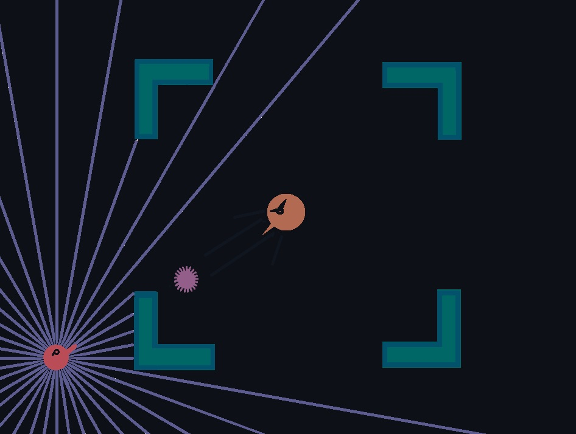

<h2 align="center"> Bullet Dodge: An Environment For Testing The Impact Of Different Neural Architectures :space_invader: </h2>

This project explores a reinforcement learning <strong>RL</strong> agent in the dynamic environment named "Bullet Dodge". It examines
the impact of environmental complexities, rule modifications, and neural network architectures. The carefully crafted environment, 
  featuring dynamic bullet trajectories, spatial awareness and strategic turret engagement, served as a challenging arena for our agent to learn optimal strategies. This work emphasizes 
adapting to unpredictable scenarios through incorporating randomness in obstacle placement and delves deeper into diverse neural 
network architectures, considering factors like neuron count and layers. 

Incentive: This study is for our Neural Network final project of CSE465 course. More information can be found here https://rb.gy/j8kty6

 

In this 2D reinforcement learning setting, depicted in Figures 1 and 3 [DIRECTIONAL_MOVEMENT.ipynb] and 2 [ROTATIONAL_MOVEMENT.ipynb], our RL agent interacts with a turret and obstacles, aiming to dodge bullets and reach the turret for successful completion. 
The virtual environment is crucial, accurately simulating bullet trajectories, turret firing patterns, and wall interactions. The algorithmic approach involves employing 
Deep Q Networks (DQN) as the primary reinforcement learning algorithm, known for its effectiveness in handling complex state spaces. The state representation includes the agent's position, 
bullet position, turret position, and ray casts for spatial awareness. These elements are transmitted to the model after being flattened into a list. The action space is tailored for specific 
scenarios in two environments. The project employs a reward system with positive rewards (0.01 points) for successful movements and increasing rewards based on proximity
to the turret, defined by the equation: <em><strong>Reward = 10/distance between agent and goal</strong></em>. Substantial bonuses (200 points) are granted for reaching and engaging the turret, 
while negative penalties discourage suboptimal strategies.

 

The two graphs above compares Mean Episodic Training Reward against the Number of Timesteps and provides valuable insights into the performance of two training
models. <em><strong>Orange(layer: 4, perceptrons: 256, learning-Rate: 0.003)</strong></em> and <em><strong>Blue(layer: 2, perceptrons: 64, Learning-Rate: 0.0001)</strong></em>
After 16 million timesteps. The agent demonstrates success with an average episode length of 129 and a peak score of 101. Despite a temporary dip attributed 
to intentional exploration, the agent adapts and refines its strategies. Training reveals the agent's progression from seeking refuge to understanding bullet 
trajectories. Two models with different architectures are compared, with the four-layer model showing stability and faster convergence. Efficient time-normalized 
progress and lower value loss further highlight the effectiveness of the four-layer architecture in mastering the primary task goal.

Future Enhancements: 
Future work involves introducing multiple agents, adding complexity with cooperation and competition dynamics. Also might
  explore attention mechanisms to enhance decision-making by focusing on salient features. 

